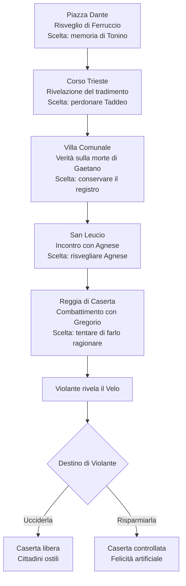

# FERRUCCIO — La Menzogna dei Borbone

> Bibbia narrativa scritta dall'autore del gioco e incollata in chat il 2026-10-07 (anche in PDF).
> Testo riportato fedelmente; qui è stata aggiunta solo la formattazione Markdown (titoli, tabelle, elenchi).
> Le note per portare la storia nel gioco sono in fondo, nella sezione «Espansioni e indicazioni per il gioco».

*Bibbia narrativa completa · Campagna principale · Archi dei personaggi · Scelte interconnesse · Finali multipli*

«Un uomo può sopportare una vita di dolore. Ma quanto dolore è disposto a infliggere agli altri per non soffrire più?»

La storia sarà costruita attorno a cinque capitoli obbligatori, nove archi narrativi principali e due finali, con numerose varianti determinate dalle decisioni del giocatore.

L'obiettivo è ottenere una storia moralmente complessa, dove anche le scelte compiute per buone ragioni possono provocare conseguenze tragiche.

## I. La verità che il giocatore non conosce

### 1839 — La tragedia del cantiere

Sei anni prima dell'inizio del gioco, Caserta è ancora impegnata nel completamento della Reggia.

Durante alcuni lavori, una struttura provvisoria cede. Diversi operai muoiono, insieme a Bianca, la figlia undicenne di Gregorio e Violante Valente.

Tra le vittime c'è anche Gaetano, padre di Ferruccio, un fabbro che tenta di salvare alcuni lavoratori rimasti intrappolati.

Il cedimento non è casuale. Un appaltatore ha utilizzato materiali scadenti per risparmiare denaro, nonostante gli avvertimenti delle maestranze.

Gregorio, capitano delle guardie, scopre la verità. Ma gli viene ordinato di firmare un rapporto che attribuisce l'incidente a un errore di Gaetano.

La morte del fabbro diventa così un disonore per la sua famiglia.

Gregorio firma.

Non perché sia un uomo malvagio, ma perché teme che una nuova indagine possa travolgere la sua famiglia, già distrutta dalla morte di Bianca.

Questa è la sua prima colpa.

### 1840–1844 — La nascita del Velo

Violante non riesce ad accettare la morte della figlia.

Un giorno trova tra gli effetti personali di Bianca un piccolo fazzoletto di seta, sul quale la bambina aveva ricamato un giglio.

Scopre che il tessuto conserva qualcosa di impossibile: stringendolo, riesce a sentire per pochi istanti la voce della figlia.

Comincia così a studiare un'antica leggenda locale, inventata per il gioco: secondo la tradizione, ogni sentimento lascia un filo invisibile nel mondo, e i fili più forti non scompaiono nemmeno dopo la morte.

Violante finanzia in segreto alcuni esperimenti nei laboratori di seta di San Leucio.

All'inizio riesce soltanto ad alleviare temporaneamente il dolore delle persone. Poi impara a separare i ricordi dalle emozioni.

Infine scopre qualcosa di terribile: eliminando non soltanto il dolore, ma anche la capacità di opporsi alla propria condizione, una persona può essere resa permanentemente felice.

Nasce il Velo della Concordia.

Gregorio conosce gli esperimenti della moglie, ma si convince che siano un modo innocuo per aiutarla a superare il lutto.

Quando comprende la vera natura del Velo, è troppo tardi. Violante lega magicamente la sua volontà al giglio d'oro che gli ha donato, trasformandolo nel Custode.

Questa è la sua seconda colpa: aver taciuto troppo a lungo.

### 1845 — Il tradimento di Ferruccio

Ferruccio è diventato fabbro come suo padre.

Lavora a piccoli incarichi per la Reggia e ama Agnese, una giovane tessitrice di San Leucio.

È proprio Agnese, inconsapevolmente, a mostrargli una stranezza: alcuni fili destinati alla Reggia si muovono anche quando nessuno aziona i telai.

Ferruccio indaga e scopre il progetto di Violante.

Chiede aiuto a Taddeo, suo amico d'infanzia, diventato guardia.

Ma Violante ha promesso a Taddeo di liberare sua sorella Mariella dal dolore e dai traumi riportati nella stessa tragedia del 1839.

Taddeo consegna Ferruccio alle guardie.

Violante potrebbe ucciderlo, ma comprende che il giovane conosce già troppo del funzionamento del Velo. Decide quindi di cancellarne la memoria e imprigionarne la coscienza in un costume da Pulcinella preparato per i festeggiamenti cittadini.

Il sortilegio fallisce parzialmente: Ferruccio perde la voce e il suo aspetto umano, ma conserva la volontà di opporsi.

### La notte dell'inizio

Il completamento della Reggia nel 1845 diventa, nella nostra storia alternativa, l'occasione per una grande festa cittadina. Il riferimento storico è solido: proprio nel 1845 furono completati anche i lavori della Sala del Trono.

Violante attiva il Velo durante i festeggiamenti.

Caserta si addormenta sotto una luna immobile.

Ferruccio si risveglia in Piazza Dante.

Non sa ancora perché è vivo.

Sa soltanto di avere perso suo padre, la propria voce e la donna che amava.

E crede che l'uomo responsabile di tutto sia Gregorio, il Custode della Reggia.

## II. Le nove storie che si intrecciano

1. Ferruccio — Identità e libertà
*Arco centrale*

2. Agnese — Amore e memoria
3. Taddeo — Tradimento e redenzione
4. Gaetano — La vendetta del figlio
5. Gregorio — Il dovere e la colpa
6. Violante — Amore trasformato in tirannia
7. Mariella — La felicità come prigione
8. Tonino — Il diritto di soffrire
9. Bianca — La figlia che non può tornare

Ogni arco ha una risoluzione propria, ma nessuno è completamente indipendente dagli altri. Per esempio, perdonare Taddeo può aiutare Ferruccio a ricostruire la verità sul padre; questa verità può influenzare il rapporto con Agnese e il confronto con Gregorio.

I temi si ripetono in forme differenti: l'amore di Ferruccio e quello di Violante, la colpa di Taddeo e quella di Gregorio, il dolore di Tonino e quello di Mariella.

Non sono nove missioni separate: sono nove modi di interpretare gli stessi avvenimenti.

## III. Arco di Ferruccio — L'eroe che nessuno vuole

*Tema: vendetta contro giustizia*

### Atto I — L'uomo che cerca un colpevole

Ferruccio inizia la storia convinto che Gregorio abbia distrutto la sua famiglia.

La sua spada, forgiata con gli ultimi strumenti del padre, rappresenta inizialmente la vendetta.

A Piazza Dante trova una targa commemorativa dedicata agli operai morti. Il nome di Gaetano è assente.

Ferruccio colpisce la targa con la spada.

Nessuna parola. Soltanto un gesto di rabbia.

### Atto II — Il dubbio

Attraverso i registri della Villa Comunale, Ferruccio scopre che suo padre non era responsabile del crollo.

La sua prima reazione è la soddisfazione: finalmente può dimostrare che la propria famiglia era stata disonorata ingiustamente.

Poi scopre che Gregorio era presente all'incidente e che aveva tentato di salvare Bianca.

Il Custode non è più semplicemente il mostro da uccidere.

È un padre che ha commesso un'ingiustizia mentre cercava di proteggere ciò che restava della propria famiglia.

### Atto III — La responsabilità

A San Leucio, Agnese può chiedere a Ferruccio di rinunciare alla vendetta.

Non gli chiede di dimenticare ciò che è accaduto, ma di non lasciare che la morte del padre determini ogni sua decisione.

Se Ferruccio sceglie di ascoltarla, il suo percorso diventa una ricerca della verità. Se insiste nell'accusare e punire chiunque sia coinvolto, arriva alla Reggia convinto che la giustizia richieda necessariamente un colpevole da abbattere.

### Atto IV — La scelta

Quando scopre che Violante è la vera responsabile del Velo, Ferruccio deve affrontare una contraddizione.

La donna che ha tolto agli abitanti la libertà è anche una persona che ha perso una figlia e ha consacrato la propria vita all'idea di impedire altre sofferenze.

Ferruccio può ucciderla e diventare il liberatore odiato di Caserta.

Oppure può lasciarla vivere e diventare uno dei pochi uomini a conoscere la menzogna su cui si regge la città.

Il suo arco non si conclude con il riconoscimento pubblico, ma con la consapevolezza che essere nel giusto non significa essere amati.

## IV. Arco di Agnese — Amare qualcuno significa ricordarlo?

*Genere: romance malinconico · Temi: memoria, sacrificio, fedeltà*

Agnese è la sottotrama sentimentale più importante. Il suo rapporto con Ferruccio si sviluppa attraverso piccoli gesti, senza trasformare il protagonista in un personaggio che parla continuamente.

### Prima della maledizione

Ferruccio e Agnese si conoscono quando lui viene inviato a riparare alcuni componenti metallici dei telai di San Leucio.

Ferruccio è impacciato, mentre Agnese è ironica e vivace.

Durante il loro primo incontro lui rompe accidentalmente una piccola ruota del telaio.

Agnese: «Siete venuto ad aggiustarlo o a finirlo?»

Ferruccio cerca di spiegarsi.

Agnese: «Ah, siete pure un uomo di poche parole. Almeno quelle non le rompete.»

Da quel momento Ferruccio comincia a inventare scuse per tornare nella manifattura.

Un giorno Agnese gli regala una lunga sciarpa rossa.

Agnese: «Dicono che il rosso protegga dal malocchio.»

Agnese: «Io non ci credo. Però con te non si sa mai.»

Ferruccio le promette che, quando avrà abbastanza denaro, apriranno insieme una bottega.

La loro promessa è semplice: una casa, un lavoro e una vita normale.

### Il segreto di Agnese

Violante aveva commissionato alle tessitrici alcuni tessuti con particolari motivi floreali.

Agnese aveva lavorato inconsapevolmente proprio sul tessuto che sarebbe diventato il Velo.

Quando comprende che i fili assorbono emozioni e ricordi, tenta di avvertire Ferruccio.

La notte dell'incantesimo Violante le sottrae tutti i ricordi del giovane, ma non riesce a cancellare completamente il sentimento.

Per questo Agnese continua a tessere la stessa sciarpa, senza sapere per chi.

### I quattro sviluppi del romance

### Percorso A — L'amore ritrovato

*Agnese risvegliata + Taddeo perdonato*

Taddeo confessa di aver consegnato Ferruccio a Violante. Aiuta Agnese a ricostruire gli ultimi giorni trascorsi insieme.

Durante il quarto capitolo, Agnese riconosce Ferruccio e gli si avvicina.

Agnese: «Non sapevo più il tuo nome.»

Agnese: «Ma ricordavo come mi guardavi.»

Gli toglie delicatamente la polvere dalla maschera.

Agnese: «Torna da me. Anche se non puoi più essere quello di prima.»

È il percorso romantico più completo, ma non garantisce un lieto fine.

### Percorso B — L'amore senza fiducia

*Agnese risvegliata + Taddeo accusato*

Agnese recupera i ricordi, ma scopre che Ferruccio ha scelto la vendetta contro il suo vecchio amico.

Comprende la rabbia del giovane, tuttavia teme che ormai sia diventata più importante del loro amore.

Agnese: «Ho aspettato un uomo per anni.»

Agnese: «Adesso ho paura che sia tornata soltanto la sua rabbia.»

Ferruccio le mostra la sciarpa consumata e tenta di prenderle la mano.

Lei gliela stringe, ma non gli promette di aspettarlo.

### Percorso C — L'amore dimenticato

*Agnese non risvegliata + Taddeo perdonato*

Ferruccio decide di non restituire i ricordi ad Agnese, perché sa quanto dolore contengono.

Taddeo cerca di convincerlo a cambiare idea.

Taddeo: «Stai facendo esattamente quello che ha fatto Violante.»

Taddeo: «Stai scegliendo al posto suo.»

Ferruccio abbassa lo sguardo.

È uno dei momenti fondamentali della trama: nel tentativo di proteggere la donna amata, Ferruccio rischia di comportarsi come la sua nemica.

### Percorso D — L'ultima sciarpa

*Agnese non risvegliata + Taddeo accusato*

Ferruccio arriva a San Leucio senza nessuno disposto ad aiutarlo.

Agnese non lo riconosce e gli offre soltanto la sciarpa appena terminata.

Agnese: «Prendila. Non so perché, ma credo che debba averla tu.»

Ferruccio prende la sciarpa, la piega accuratamente e le fa un inchino.

Agnese sorride.

Agnese: «Che tipo buffo.»

Dopo la sua partenza, si accorge di stare piangendo senza conoscerne il motivo.

Il ricordo recuperato da Tonino nel primo capitolo può aggiungere una lettera d'amore scritta da Agnese prima della maledizione. La lettera non cambia il percorso obbligatorio, ma rende le scene del Belvedere più personali.

### Il destino di Agnese nei due finali

### Se Violante muore

Il Velo si spezza e Agnese recupera ogni ricordo, indipendentemente dalla scelta compiuta nel quarto capitolo.

Se era stata risvegliata in precedenza, riconosce immediatamente Ferruccio tra la folla. Se invece era rimasta addormentata, il suo riconoscimento avviene soltanto dopo la morte di Violante.

Tuttavia, vedere il giovane con la spada davanti al corpo della benefattrice la sconvolge.

La città vuole arrestarlo e alcuni cittadini vogliono ucciderlo.

Se Agnese lo amava ancora, tenta di fermarlo per costringerlo a consegnarsi alle guardie, convinta che sia l'unico modo per salvarlo dal linciaggio.

Agnese: «Fermati! Non voglio perderti un'altra volta!»

Ferruccio deve scattare oltre di lei mentre tenta di bloccarlo.

Anche Agnese, quindi, diventa un NPC ostile, come richiesto per il mondo liberato. Non agisce per odio, ma perché desidera impedirgli di fuggire.

Se il rapporto era ormai compromesso, invece, lo accusa direttamente.

Agnese: «Hai liberato tutti. Ma chi ti ha dato il diritto di decidere chi deve morire?»

### Se Violante sopravvive

Il Velo viene ripristinato.

Se Agnese aveva recuperato i ricordi, Violante li cancella nuovamente, ma alcuni gesti rimangono impressi nel suo corpo.

Quando Ferruccio le passa davanti, Agnese si tocca istintivamente il polso, proprio come faceva lui.

Se non aveva mai recuperato i ricordi, continua semplicemente a tessere.

In entrambi i casi, rimane nella manifattura, sorridente e apparentemente felice.

Ultima battuta: «Devo finire una sciarpa. Sento che qualcuno verrà a prenderla.»

## V. Arco di Taddeo — Quanto vale un tradimento?

*Genere: dramma e redenzione · Tema: il prezzo della lealtà*

Taddeo è il personaggio che deve rappresentare la fragilità morale degli uomini comuni.

Non è crudele. È un uomo che ha avuto paura e ha fatto qualcosa di terribile per proteggere una persona amata.

### Il passato condiviso

Da bambini, Taddeo e Ferruccio giocavano tra le strade di Caserta, fingendo di essere cavalieri.

Ferruccio costruiva spade di legno. Taddeo voleva sempre essere il comandante.

Quando Gaetano muore, Taddeo promette di proteggere Ferruccio come un fratello.

Anni dopo entra nella guardia e viene assegnato alla sorveglianza degli edifici reali.

Sua sorella Mariella, sopravvissuta al crollo del 1839, continua però a soffrire di incubi e terribili crisi di paura.

Violante lo avvicina.

Violante: «Tua sorella non merita ciò che ha vissuto.»

Violante: «Dammi il nome di chi sta indagando. Io le restituirò la pace.»

Taddeo consegna il nome di Ferruccio.

### Il confronto su Corso Trieste

Dopo aver sconfitto la Regina dei Debiti, Ferruccio trova Taddeo accanto a una vetrina.

Il giovane riconosce la spada.

Taddeo: «No... Quella l'abbiamo forgiata insieme.»

Taddeo: «Ti prego, lascia che ti spieghi.»

Ferruccio può scegliere come reagire.

### Se lo perdona

Taddeo confessa di aver denunciato Ferruccio per salvare Mariella.

Taddeo: «Mi aveva promesso che mia sorella sarebbe stata bene.»

Taddeo: «E io le ho creduto. Che Dio mi perdoni.»

Ferruccio rinfodera la spada.

Taddeo decide di aiutarlo. Non diventa un secondo protagonista: lascia messaggi, documenti e testimonianze lungo il percorso obbligatorio.

A San Leucio può raccontare ad Agnese la verità su Ferruccio.

### Se lo accusa

Ferruccio gli punta la spada alla gola.

Taddeo arretra.

Taddeo: «Se mi uccidi, lei resterà comunque là dentro!»

Ferruccio non lo uccide, ma rifiuta di ascoltarlo.

Taddeo fugge e decide di cercare i documenti che potrebbero incriminarlo.

Diventa un antagonista secondario, senza richiedere un combattimento aggiuntivo.

### Le quattro risoluzioni

| Decisioni | Esito dell'arco |
|---|---|
| Perdonato + registro conservato | Taddeo confessa ufficialmente la falsificazione e indica gli altri responsabili. |
| Perdonato + registro bruciato | Taddeo confessa, ma la sua testimonianza non può essere verificata. |
| Accusato + registro conservato | Taddeo tenta di nascondere la propria complicità; Ferruccio possiede comunque la prova. |
| Accusato + registro bruciato | Taddeo riesce a negare pubblicamente il tradimento. Rimane però tormentato dalla colpa. |

### Il destino finale di Taddeo

Se Violante viene uccisa, anche Taddeo diventa ostile a Ferruccio.

Nel percorso della redenzione cerca di arrestarlo, convinto che una resa possa impedirne l'uccisione. Non vuole infliggergli una nuova ingiustizia, ma è ancora incapace di opporsi completamente alle autorità.

Taddeo: «Una volta ti ho consegnato per paura. Stavolta vieni con me di tua volontà!»

Se invece non era stato perdonato, partecipa apertamente alla caccia contro Ferruccio, utilizzando la sua presunta colpevolezza per distogliere l'attenzione dai propri crimini.

Se Violante viene risparmiata, Taddeo continua a essere una guardia. La sua redenzione, se raggiunta, rimane incompleta: ricorda a tratti di aver tradito qualcuno, ma il Velo gli impedisce di sostenere il peso di quella memoria.

## VI. Arco di Gaetano — La verità sotto la pietra

*Genere: mistero familiare · Tema: vendetta e memoria storica*

Il padre di Ferruccio compare soltanto attraverso i suoi oggetti, i documenti e le anime liberate.

Non deve trasformarsi in un fantasma che accompagna e spiega tutto al giocatore.

### La falsa versione ufficiale

Una targa nel centro cittadino riporta:

«In memoria degli uomini caduti nell'adempimento del loro dovere.»

Tra i registri pubblici, invece, Gaetano compare come responsabile dell'incidente.

Ferruccio trova il suo vecchio punzone da fabbro accanto alla fontana della Villa Comunale.

Sul manico sono incise due lettere: G. F.

### Il ricordo della tragedia

Sconfiggendo la Madre di Marmo, Ferruccio libera una memoria del padre.

Il giocatore vede soltanto una breve immagine immobile: Gaetano sorregge una trave mentre alcuni operai si mettono in salvo.

Si sente la sua voce.

Gaetano: «Prima fate uscire i ragazzi!»

L'immagine scompare.

Ferruccio capisce che suo padre morì cercando di salvare altre persone.

### La scelta del registro

Il documento originale contiene le cancellature e le correzioni che dimostrano la falsificazione.

Ferruccio può conservarlo o distruggerlo.

Conservare il registro significa accettare che la verità sul padre debba essere mostrata agli altri, anche se richiederà anni.

Bruciare il registro significa rifiutare che il nome di Gaetano continui a essere associato all'incidente, ma distrugge anche la prova della sua innocenza.

L'atto di bruciare il documento è emotivamente comprensibile, ma non risolve l'ingiustizia.

### Conseguenza sui finali

Nel finale della liberazione, la verità emerge, ma i cittadini non sono disposti ad ascoltare Ferruccio mentre viene accusato di aver ucciso Violante.

Se ha conservato il registro, fugge portando con sé la prova che un giorno potrebbe riabilitare suo padre.

Se lo ha bruciato, fugge con il solo ricordo di ciò che ha visto.

Nel finale del Velo, i documenti vengono nuovamente alterati nella memoria collettiva.

Il padre rimane il colpevole ufficiale, anche se Ferruccio ha conservato il registro.

## VII. Arco di Gregorio — Il Custode prigioniero

*Genere: tragedia · Temi: dovere, amore, complicità*

Gregorio è il falso antagonista principale.

La sua storia deve essere percepita progressivamente, facendo credere per gran parte della campagna che sia lui a controllare Caserta.

### Il suo passato

Gregorio è un militare fedele alla Corona, incaricato della sicurezza della Reggia.

È rispettato per la disciplina e per l'attenzione alle famiglie degli operai.

Quando perde Bianca, la sua vita cambia.

Crede inizialmente che Violante abbia trovato conforto nell'attività benefica. Non si accorge che sua moglie sta costruendo una forma di potere sempre più assoluta.

Quando finalmente cerca di opporsi, Violante lo imprigiona nella sua stessa armatura.

Gregorio rimane cosciente, ma ogni suo movimento viene controllato dal Velo.

Per questo i suoi attacchi sono violenti e regolari, come quelli di una macchina che continua a eseguire un ordine.

### Come il giocatore può intuire la verità

Nella Villa Comunale Ferruccio trova una statua che rappresenta un cavaliere inginocchiato davanti a un giglio.

Sulla base è inciso:

«Non tutte le catene fanno rumore.»

A San Leucio scopre che la stessa forma floreale compare sulle stoffe commissionate da Violante.

Durante lo scontro finale, ogni volta che Gregorio subisce un colpo, il giglio sul suo petto emette un lampo.

In alcuni momenti il Custode sembra voler abbassare l'alabarda, ma una forza lo obbliga a sollevarla.

### I due confronti possibili

Se Ferruccio possiede prove o testimonianze e cerca di parlargli:

Ferruccio mostra il registro o il messaggio di Taddeo.

Gregorio si ferma per un istante.

Gregorio: «Gaetano...»

Gregorio: «Gli abbiamo fatto un torto terribile.»

Poi il giglio si illumina.

Gregorio: «Va' via. Prima che mi faccia ucciderti.»

Il combattimento comincia.

Se Ferruccio lo attacca senza tentare il dialogo:

Gregorio solleva immediatamente l'alabarda.

Gregorio: «Un altro figlio viene a chiedermi conto dei padri.»

Il combattimento comincia senza che il giocatore sappia quanto Gregorio sia ancora cosciente.

### La morte del Custode

Al termine dello scontro, l'armatura si spezza. Gregorio cade sulle ginocchia.

Il giocatore vede per la prima volta un volto umano dietro l'elmo.

Gregorio: «Non era un ordine del Re...»

Gregorio: «Era una promessa fatta a mia moglie.»

Se Ferruccio aveva tentato di farlo ragionare con delle prove, Gregorio aggiunge:

Gregorio: «Tuo padre era innocente.»

Se non lo aveva fatto:

Gregorio: «Anche io avevo paura di perderla.»

Gregorio muore e la sua anima sale lentamente verso il balcone.

Ferruccio solleva lo sguardo.

Violante è lì.

L'ultima immagine della sua sottotrama è il mantello rosso, vuoto, rimasto sull'armatura.

Gregorio muore in entrambi i finali: il cambiamento riguarda la lucidità dei suoi ultimi istanti e le verità che riesce a confessare.

## VIII. Arco di Violante — La madre che voleva fermare il dolore

*Genere: tragedia politica e familiare · Tema: protezione contro controllo*

Violante deve essere una figura credibile, non una semplice antagonista che desidera conquistare il potere.

Il giocatore dovrebbe provare comprensione per il suo dolore, pur riconoscendo la crudeltà delle sue azioni.

### La donna prima della tragedia

Violante era molto amata a Caserta.

Organizzava distribuzioni di viveri, si occupava delle famiglie degli operai e finanziava l'istruzione di alcuni bambini.

A differenza di molti nobili, conosceva personalmente le persone che aiutava.

Durante il funerale di Bianca rimane immobile davanti alla piccola bara.

Gregorio tenta di prenderle la mano.

Violante: «Non voglio più vedere un bambino morire.»

La frase nasce da un desiderio autenticamente generoso.

Ma con il passare degli anni si trasforma in un'ossessione.

### La progressione morale

**1** — Alleviare il dolore

Violante usa piccoli frammenti di seta per aiutare le persone a riposare durante il lutto. I primi esperimenti sono temporanei e sembrano benefici.

**2** — Cancellare il dolore

I soggetti dimenticano le persone scomparse. Violante si convince che sia un sacrificio accettabile.

**3** — Impedire nuovi dolori

Capisce che gelosia, desiderio, ambizione e disaccordo possono produrre sofferenza. Decide di controllare anche questi sentimenti.

**4** — Eliminare la libertà

Il Velo diventa permanente. Violante non cerca più il consenso, perché considera ogni opposizione una prova del fatto che le persone non sanno cosa sia meglio per loro.

### Il tradimento di suo marito

Quando Gregorio scopre il progetto, le chiede di fermarsi.

Gregorio: «Bianca non avrebbe voluto questo.»

Violante: «Bianca non vuole più niente.»

Gregorio rimane in silenzio.

Violante: «E non permetterò che un'altra madre debba pronunciare quelle parole.»

Quando Gregorio tenta di distruggere il primo nucleo del Velo, Violante lo lega al giglio d'oro.

È il momento in cui l'amore si trasforma definitivamente in possesso.

Perché Ferruccio non può semplicemente distruggere il Velo?

Il tessuto custodito a San Leucio è soltanto il mezzo attraverso cui la magia è stata diffusa. Il vero nucleo del Velo è legato alla vita di Violante.

Gregorio era il guardiano e il giglio il dispositivo attraverso cui lei trasmetteva gli ordini, ma Violante è l'ultimo nodo vivente dell'incantesimo.

Spezzare il giglio libera Gregorio dal comando, troppo tardi per salvarlo. Non libera la città.

Ferruccio può distruggere definitivamente il Velo soltanto uccidendo Violante.

Se la risparmia, lei può ricucire i fili e ripristinare il proprio controllo.

Questo rende i due finali inevitabilmente opposti, senza introdurre una soluzione perfetta nascosta.

### L'ultima conversazione

Violante: «Guardati. Hai attraversato un'intera città per uccidere qualcuno.»

Ferruccio tiene la spada alzata.

Violante: «Io ho fatto tutto questo affinché nessuno dovesse farlo mai più.»

Il ragazzo guarda la città oltre il cortile.

Violante: «Se mi uccidi, torneranno la fame, l'odio e la paura.»

Violante: «Se mi risparmi, continueranno a sorridere.»

Dopo qualche istante, la donna si inginocchia accanto al mantello del marito.

Violante: «Dimmi, Ferruccio. Chi di noi due è davvero un mostro?»

La risposta appartiene al giocatore.

Se la uccide, Violante muore convinta di essere stata tradita dall'umanità che voleva proteggere.

Se la risparmia, non si pente: continua a governare la città attraverso il Velo. Il giocatore le ha dimostrato che può ottenere obbedienza persino da chi conosce la verità.

## IX. Arco di Mariella — La sorella che non soffre più

*Genere: dramma familiare · Tema: il valore delle emozioni*

Mariella non deve necessariamente apparire come personaggio giocabile o avere un modello 3D. La sua storia può essere raccontata attraverso Taddeo, una finestra illuminata, una lettera e una breve sagoma durante il finale.

### Prima del Velo

Mariella era una ragazza vivace, molto legata al fratello.

Dopo essere sopravvissuta al crollo del 1839, aveva sviluppato una profonda paura degli spazi chiusi e dei rumori improvvisi.

Taddeo la sentiva piangere quasi tutte le notti.

Quando Violante offre il suo aiuto, il giovane accetta immediatamente.

Il Velo elimina la paura di Mariella, ma insieme a essa scompaiono la curiosità, il desiderio di viaggiare e gran parte della sua personalità.

Adesso trascorre intere giornate seduta accanto alla finestra, sorridendo.

### La lettera di Mariella

Se Taddeo viene perdonato, Ferruccio può leggere una lettera che Mariella aveva scritto prima dell'incantesimo.

Caro Taddeo,

non devi aggiustarmi.

Voglio soltanto che, quando ho paura, tu rimanga con me.

Tua sorella.

Taddeo comprende di aver tradito Ferruccio per ottenere qualcosa che Mariella non gli aveva mai chiesto.

### I possibili esiti

| Taddeo | Finale | Destino di Mariella |
|---|---|---|
| Perdonato | Violante uccisa | Mariella riacquista la capacità di provare paura. Taddeo comprende che può accompagnarla, ma non cancellare ciò che ha vissuto. |
| Accusato | Violante uccisa | Mariella torna a provare emozioni, ma scopre che suo fratello ha tradito un amico per lei. Lo respinge. |
| Perdonato | Violante risparmiata | Mariella continua a sorridere. Taddeo conserva a tratti il ricordo della lettera, senza trovare il coraggio di opporsi. |
| Accusato | Violante risparmiata | Mariella rimane serena e Taddeo si convince che il tradimento sia stato necessario. |

La frase centrale di questo arco è: «Non devi aggiustarmi.»

È anche una risposta indiretta alla convinzione di Violante che ogni sofferenza debba essere eliminata.

## X. Arco di Tonino — Il venditore che ha dimenticato sua moglie

*Genere: malinconia e ironia campana · Tema: il diritto al lutto*

Tonino rappresenta le persone comuni della città. Non è un nobile, un soldato o un eroe: è un uomo che ha trascorso la vita vendendo mozzarelle e raccontando storie.

### Primo incontro

Ferruccio lo trova in Piazza Dante dietro un banchetto illuminato da una lanterna.

Tonino: «Uagliò, ma che è 'sta faccia?»

Ferruccio indica la propria maschera.

Tonino: «Ah, è proprio la tua. E che ne sapevo io?»

Gli offre una mozzarella.

Tonino: «Mangia. Magari sotto 'sta maschera ce sta ancora qualcuno.»

Dopo la sconfitta del Gatto dei Quattro Canti, Ferruccio raccoglie un'anima contenente il ricordo della moglie di Tonino, Rosa.

Può restituirglielo oppure lasciarlo dimenticato.

### Se restituisce il ricordo

Tonino riconosce un vecchio medaglione appartenuto a Rosa.

Tonino: «Rosa...»

Tonino: «Maronna mia. Erano anni che non dicevo il suo nome.»

Comincia a piangere.

Ferruccio si avvicina.

Tonino: «Nun fa niente, guagliò.»

Tonino: «Mi mancava pure questo.»

Da quel momento Tonino mantiene la sua ironia, ma le sue battute diventano più consapevoli. Inoltre ricorda di aver custodito una vecchia lettera di Agnese.

### Se non restituisce il ricordo

Tonino continua a sorridere.

Tonino: «Moglie? Io? E chi se la ricorda!»

Ride da solo, poi torna a fissare una sedia vuota accanto al banchetto.

In questo percorso Ferruccio non ottiene la lettera da Tonino, ma può comunque ricostruire la relazione con Agnese attraverso gli altri eventi della storia.

### Le quattro scene conclusive

### Ricordo restituito + Violante uccisa

Tonino è tornato capace di soffrire e sa che Ferruccio lo ha aiutato. Ma conosce anche le opere di carità di Violante e non accetta che sia stata uccisa.

Tonino: «Mi hai ridato mia moglie nei ricordi. Ma questo non ti dava diritto di togliere una vita!»

Gli scaglia contro un oggetto e tenta di fermarlo.

### Ricordo non restituito + Violante uccisa

Il Velo scompare e Tonino ricorda improvvisamente Rosa.

Sconvolto dal dolore e dalla notizia dell'uccisione di Violante, si unisce alla folla.

Tonino: «E tu saresti quello che ci ha salvati?»

### Ricordo restituito + Violante risparmiata

Il Velo torna a cancellare il suo lutto. Tonino canticchia mentre sistema due piatti sul tavolo.

Tonino: «Uno per me e uno per... boh. Sarà l'abitudine.»

### Ricordo non restituito + Violante risparmiata

Tonino rimane identico al primo incontro.

Tonino: «Sempre una bella giornata! Pure quando piove!»

Il suo arco è volutamente piccolo, perché dimostra quanto una singola scelta possa cambiare il modo in cui il giocatore interpreta la stessa persona.

## XI. Arco di Bianca — La bambina che non può essere salvata

*Genere: fiaba tragica · Tema: accettazione della perdita*

Bianca è morta nel 1839. Il gioco non deve riportarla in vita, né trasformarla in un boss.

È presente attraverso tre oggetti: il fazzoletto con il giglio, un disegno della Reggia ancora incompleta e una piccola scatola musicale.

### Primo indizio — Piazza Dante

Vicino a una finestra si trova una vecchia filastrocca dedicata ai bambini.

«Quando il giglio si addormenta, la luna ascolta e non si lamenta.»

Non è ancora chiaro cosa significhi.

### Secondo indizio — Villa Comunale

Una memoria conservata nel marmo mostra Gregorio mentre insegna a Bianca a fare un inchino.

La bambina ride e sbaglia apposta.

Bianca: «Ancora! Ma stavolta fallo tu!»

Il ricordo svanisce quando Gregorio cerca di prenderle la mano.

### Terzo indizio — San Leucio

Accanto ai telai si trova un piccolo fazzoletto ricamato con un giglio incompleto.

Agnese spiega che Violante chiedeva spesso di riprodurre quel disegno.

Agnese: «Nessuno riusciva a farlo uguale.»

Agnese: «Forse perché era stato fatto da una bambina.»

### Quarto indizio — Reggia

Poco prima della scelta finale, Ferruccio trova una scatola musicale.

La melodia è la stessa che si sente, debolmente, durante tutti gli incontri con le statue.

Violante la apre.

Violante: «Aveva promesso di imparare a suonarla.»

Violante: «Non ne ha avuto il tempo.»

Ferruccio comprende finalmente che il Velo non è stato creato per riportare Bianca in vita.

È stato creato perché sua madre non potesse più provare il dolore di averla perduta.

### Chiusura dell'arco

Se Violante muore, il ricordo di Bianca viene liberato. Il giocatore vede il giglio ricamato perdere la sua luce soprannaturale. Rimane un semplice fazzoletto.

Se Violante vive, il giglio continua a brillare. La scatola musicale suona da sola e Violante ascolta una voce che ripete sempre lo stesso verso della filastrocca.

Non sappiamo se sia davvero la voce di Bianca o soltanto un ricordo catturato dalla magia.

Il dubbio deve rimanere irrisolto.

## XII. Gli archi dei boss intermedi

Oltre ai personaggi umani, anche i quattro boss che precedono la rivelazione di Violante devono raccontare una parte del mistero.

| Boss e capitolo | Origine narrativa | Rivelazione dopo la sconfitta |
|---|---|---|
| Gatto dei Quattro Canti — Piazza Dante | Formato dai ricordi domestici sottratti alle famiglie. | Ferruccio comprende che le creature d'ombra custodiscono qualcosa di umano. |
| Regina dei Debiti — Corso Trieste | Nata dalle ambizioni e dalle promesse mai mantenute durante i lavori della Reggia. | Le vespe trasportano desideri rubati verso il palazzo. |
| Madre di Marmo — Villa Comunale | Statua che custodisce i ricordi degli operai morti. | Gaetano non causò l'incidente, ma tentò di salvare gli altri. |
| Tessitrice di Pietra — San Leucio | Statua utilizzata come guardiana dei telai incantati. | Il Velo nasce dalla seta e il giglio è il simbolo che lega i guardiani a Violante. |

Nessuno di questi boss è malvagio nel senso tradizionale: tutti sono manifestazioni o prigionieri dell'incantesimo.

Per questo, quando vengono sconfitti, non lasciano cadaveri. Si dissolvono in anime colorate che salgono lentamente.

Il giocatore deve inizialmente credere di stare distruggendo mostri e comprendere, capitolo dopo capitolo, che sta liberando ciò che rimane delle persone.

Dal punto di vista produttivo, i boss intermedi possono utilizzare versioni ingrandite e modificate dei comportamenti già previsti nella demo: pattugliamento e balzi del gatto, inseguimento delle vespe, proiettili luminosi delle statue.

## XIII. Tutte le combinazioni delle scelte

La campagna prevede sei decisioni binarie, di cui l'ultima determina il finale.

**5** — Scelte prima del finale

**32** — Possibili percorsi prima della Reggia

**64** — Combinazioni totali con i due finali

Per rendere realizzabile il gioco, queste 64 combinazioni non richiedono 64 campagne scritte separatamente.

La soluzione narrativa è dividere il sistema in otto percorsi fondamentali, ciascuno con due finali. Le decisioni riguardanti Tonino e Gregorio aggiungono ulteriori varianti di dialogo e rivelazione.

In questo modo tutte le combinazioni sono previste, ma le scene principali possono essere riutilizzate.

### Gli otto percorsi fondamentali

Questi derivano da tre decisioni: perdonare o accusare Taddeo, conservare o bruciare il registro, risvegliare o meno Agnese.

### Percorso 1 — La verità condivisa

*P · C · R*

Ferruccio perdona Taddeo, conserva il registro e restituisce la memoria ad Agnese.

Arriva al finale con la storia del padre ricostruita, l'amore ritrovato e un amico che cerca di riscattarsi.

Violante uccisa: è il percorso più dolorosamente ironico. Ferruccio possiede le prove, ma nessuno vuole ascoltarle. Taddeo cerca di arrestarlo per proteggerlo dalla folla; Agnese tenta di trattenerlo per salvarlo.

Violante risparmiata: le testimonianze vengono dimenticate, l'amore di Agnese viene cancellato ancora una volta e il registro rimane come unica prova materiale di una verità che nessuno desidera conoscere.

### Percorso 2 — Il sacrificio del sentimento

*P · C · S*

Ferruccio perdona Taddeo e conserva il registro, ma sceglie di non risvegliare Agnese.

Ha cercato la verità per suo padre, ma non ha avuto il coraggio di imporne il peso alla donna amata.

Violante uccisa: Agnese recupera tutto improvvisamente. Il loro primo vero incontro avviene mentre Ferruccio è accusato di omicidio. Lei cerca di farlo consegnare alle guardie.

Violante risparmiata: Agnese rimane inconsapevole. Taddeo può comprendere l'identità di Ferruccio nei momenti in cui il Velo si indebolisce, ma non riesce più a parlarne apertamente.

### Percorso 3 — La parola contro il potere

*P · B · R*

Ferruccio perdona Taddeo e risveglia Agnese, ma brucia il documento che avrebbe potuto riabilitare suo padre.

L'amore e l'amicizia sopravvivono, ma la verità non ha più una prova scritta.

Violante uccisa: Taddeo tenta di testimoniare, ma la folla lo accusa di aver aiutato un assassino. Agnese chiede a Ferruccio di arrendersi prima che qualcuno rimanga ucciso.

Violante risparmiata: la testimonianza di Taddeo viene soffocata dal Velo. Senza documenti, Ferruccio non possiede più nulla che possa confermare quanto accaduto.

### Percorso 4 — Il peso della pietà

*P · B · S*

Ferruccio perdona Taddeo, distrugge il registro e lascia Agnese nella sua serenità.

Ha scelto di proteggere le persone a cui vuole bene, evitando di costringerle ad affrontare il passato.

Ma arriva alla Reggia sempre più simile, nelle sue scelte, a Violante.

Violante uccisa: spezza la prigionia di una città alla quale aveva cercato di risparmiare la verità. Gli altri recuperano improvvisamente ricordi che Ferruccio aveva deciso di nascondere.

Violante risparmiata: accetta la propria contraddizione. La città resta tranquilla, Taddeo rimane una guardia e Agnese continua ad attendere qualcuno che non ricorda.

### Percorso 5 — La giustizia senza perdono

*A · C · R*

Ferruccio accusa Taddeo, conserva le prove e risveglia Agnese.

Ha scelto di conoscere tutta la verità, ma non è disposto a perdonare chi ha contribuito a nasconderla.

Violante uccisa: Taddeo conduce le guardie contro di lui per proteggere la propria posizione. Agnese riconosce Ferruccio, ma non accetta il suo ricorso alla violenza. Il registro rimane una prova per il futuro.

Violante risparmiata: Agnese viene nuovamente privata dei ricordi, mentre Taddeo nasconde le proprie responsabilità. Ferruccio comprende che avere ragione non gli è servito a nulla.

### Percorso 6 — La prova senza amore

*A · C · S*

Ferruccio accusa Taddeo, conserva il registro e lascia Agnese nel Velo.

Ha conservato tutto ciò che può dimostrare un'ingiustizia, ma ha sacrificato i legami personali per perseguirla.

Violante uccisa: fugge con il documento mentre Taddeo lo insegue. Agnese recupera improvvisamente i propri ricordi e cerca di fermarlo tra la folla.

Violante risparmiata: mantiene la prova di una verità che nessuno vuole riconoscere. Agnese vive serenamente e Taddeo continua a negare il passato.

### Percorso 7 — L'amore sopra ogni cosa

*A · B · R*

Ferruccio accusa Taddeo, brucia il registro e risveglia Agnese.

Non vuole più inseguire i documenti e i colpevoli della tragedia: desidera soltanto tornare dalla persona amata.

Ma non riesce a rinunciare al rancore contro chi lo ha tradito.

Violante uccisa: Agnese gli chiede perché abbia scelto un'ultima morte proprio quando avrebbero potuto ricominciare. Taddeo approfitta della situazione per accusarlo.

Violante risparmiata: Ferruccio sacrifica l'ultima possibilità di recuperare stabilmente Agnese. La vede sorridere, sapendo che quel sorriso non gli appartiene più.

### Percorso 8 — Il cavaliere senza nessuno

*A · B · S*

Ferruccio accusa Taddeo, distrugge il registro e non risveglia Agnese.

È il percorso più solitario. Non ha alleati, non possiede prove materiali e ha rinunciato alla possibilità di ritrovare il proprio amore prima del confronto finale.

Violante uccisa: la città torna libera e Ferruccio diventa il nemico pubblico. Fugge senza poter contare su nessuno.

Violante risparmiata: accetta di vivere come l'unico testimone cosciente di un mondo costruito sulla menzogna. Non gli resta altro che la propria memoria.

P = Taddeo perdonato · A = Taddeo accusato · C = registro conservato · B = registro bruciato · R = Agnese risvegliata · S = Agnese lasciata nel sogno.Le ulteriori varianti che completano le 64 combinazioni

A ciascuno degli otto percorsi si aggiungono le scelte su Tonino e sul confronto con Gregorio.

| Tonino | Gregorio | Variante narrativa |
|---|---|---|
| Ricordo restituito | Dialogo cercato | Ferruccio conosce anche la storia di Rosa, possiede la lettera di Agnese e tenta una soluzione non violenta con Gregorio. |
| Ricordo restituito | Attacco immediato | Ferruccio dimostra compassione per Tonino, ma sceglie la violenza contro il Custode. |
| Ricordo non restituito | Dialogo cercato | Ferruccio protegge Tonino dalla sofferenza, ma tenta di comprendere Gregorio. |
| Ricordo non restituito | Attacco immediato | Ferruccio evita il dolore personale degli altri, ma affronta il Custode come un nemico da abbattere. |

Il dialogo con Gregorio rivela la sua complicità in anticipo soltanto se Ferruccio possiede il registro o la testimonianza di Taddeo. In caso contrario, la rivelazione avviene dopo lo scontro.

In termini di sceneggiatura, il sistema è completo:

8 percorsi principali × 4 varianti di Tonino/Gregorio × 2 finali = 64 combinazioni.

Ognuna eredita le scene e le conseguenze definite negli archi precedenti. Le 64 configurazioni non corrispondono a 64 finali indipendenti: sono varianti coerenti di due esiti per Caserta.

## XIV. Le scelte non sono un sistema di moralità

Non assegnerei punti buono o cattivo alle decisioni.

Un giocatore potrebbe perdonare Taddeo per misericordia, ma lasciare Agnese nel Velo perché incapace di affrontare la possibilità di perderla.

Un altro potrebbe rifiutare il perdono, conservare ogni prova e uccidere Violante, convinto che la verità sia più importante di qualunque rapporto personale.

Nessuna combinazione deve essere considerata automaticamente giusta.

Per questo sono importanti quattro principi narrativi:

1. La scelta riguarda sempre una persona concreta. Non si sceglie astrattamente tra bene e male, ma tra il ricordo e la serenità di Tonino, tra la fiducia e la rabbia verso Taddeo, tra la libertà e la sicurezza di Agnese.
2. Il giocatore deve comprendere cosa sta sacrificando. Prima di prendere una decisione, riceve indizi sufficienti sulle sue conseguenze immediate.
3. Le rivelazioni fondamentali sono inevitabili. Nessuna scelta deve impedire di comprendere chi controlla il Velo, perché lo ha creato e quale prezzo comporta distruggerlo.
4. Le conseguenze devono essere mostrate, non spiegate. Un personaggio che non riconosce una sciarpa, una guardia che abbassa lo sguardo e una lettera mai consegnata raccontano più di una lunga schermata di testo.

## XV. Come si svolgono gli archi durante la campagna

L'intreccio deve essere percepito come un'unica avventura, non come una successione di missioni secondarie.

### Struttura narrativa lineare

*(Diagramma ricostruito dalle etichette del grafico incollato.)*

Ogni decisione modifica le scene successive, ma il percorso principale rimane invariato.

### Le scene obbligatorie

| Capitolo | Scena narrativa indispensabile | Scena condizionale |
|---|---|---|
| Piazza Dante | Risveglio e incontro con Tonino | Ricordo di Rosa, lettera di Agnese |
| Corso Trieste | Taddeo riconosce Ferruccio | Confessione o fuga |
| Villa Comunale | Apparizione del ricordo di Gaetano | Registro conservato o distrutto |
| San Leucio | Incontro con Agnese e scoperta del Velo | Riavvicinamento romantico o addio inconsapevole |
| Reggia | Scontro con Gregorio e rivelazione di Violante | Confessione anticipata, scelta finale |

Le informazioni che il giocatore potrebbe perdere a causa di una scelta vengono sempre recuperate in forma essenziale durante la rivelazione finale. Nessuno deve arrivare alla decisione su Violante senza sapere cosa sta scegliendo.

## XVI. La conclusione cinematografica completa

### Scena 1 — Il Custode sconfitto

### Cortile d'Onore · Notte · Poche luci calde

Gregorio cade in ginocchio.

L'alabarda tocca il pavimento con un rumore metallico.

Il giglio sul suo petto si incrina, poi si spezza.

Dall'armatura esce una piccola luce azzurra.

Gregorio: «Ho protetto la porta per tutta la vita...»

Gregorio: «E non ho visto cosa entrava.»

Ferruccio si avvicina.

Gregorio tende una mano verso il balcone.

Gregorio: «Lei... crede ancora di poterla salvare.»

Il Custode muore.

Dall'alto si sente una voce femminile.

Violante: «Gregorio?»

La donna compare sul balcone.

Violante: «Avevi promesso che saremmo rimasti insieme.»

Scende lentamente una breve scala laterale, mentre le torce si spengono una dopo l'altra.

Violante: «E tu devi essere Ferruccio.»

Lo osserva con tristezza.

Violante: «Pensavo di averti tolto abbastanza ricordi da farti riposare.»

Ferruccio punta la spada verso di lei.

Violante: «Non ho mai odiato questa città.»

Una finestra si illumina dietro il colonnato.

Violante: «L'ho amata più di quanto meritasse.»

La donna mostra il fazzoletto di Bianca.

Violante: «Ed è per questo che non posso lasciarla andare.»

Il giocatore vede i fili dorati irradiarsi da Violante fino alle strade di Caserta.

### Scena 2 — Il bivio

### Schermata di scelta

Quanto vale la felicità?

Violante attende la tua decisione.

### Spezza il Velo

La città sarà libera. Tornerà anche il dolore.

### Risparmia Violante

La città resterà in pace. Nessuno potrà più scegliere.

### Se Ferruccio uccide Violante

Ferruccio avanza.

Violante non tenta di difendersi.

Violante: «Allora non hai imparato niente.»

Ferruccio affonda la spada.

Il giglio ricamato si spegne e i fili che attraversano la città si spezzano.

Per un istante non si sente nulla.

Poi una donna comincia a piangere.

Un bambino chiama sua madre.

Un uomo ride davvero, sorpreso dalla propria risata.

La luce della luna lascia spazio a un cielo azzurro e vivace.

Ferruccio osserva la città finalmente libera.

Poi una guardia entra nel cortile.

Guardia: «La Signora! L'ha ammazzata!»

Una seconda guardia vede Gregorio a terra.

Seconda guardia: «Ha ucciso anche il Custode!»

Gli abitanti accorrono.

Un cittadino: «Era lei che dava da mangiare ai nostri figli!»

Un altro: «Assassino!»

Ferruccio tenta di mostrare la propria sciarpa, la spada e, se lo possiede, il registro. Nessuno è disposto ad ascoltarlo in mezzo al caos.

Dalla folla emerge Agnese.

La sua battuta dipende dall'arco romantico raggiunto.

Se aveva recuperato la memoria:

Agnese: «Ferruccio... ti prego. Non scappare. Posso ancora aiutarti!»

Se non l'aveva recuperata:

Agnese: «Sei tu... Sei davvero tu? Perché hai fatto questo?»

Anche lei tenta di fermarlo.

Comincia una breve fuga giocabile nel Cortile e verso Piazza Dante. Tutti gli NPC incontrabili sono ostili: alcuni cercano di arrestare Ferruccio, altri lo colpiscono in preda alla rabbia e al panico.

È fondamentale che non siano controllati da alcuna magia. La loro ostilità deve essere il risultato delle loro scelte, della paura e della fedeltà a Violante.

Ferruccio riesce a fuggire.

Sul nero compare una frase:

«Il primo dono della libertà fu il diritto di odiarlo.»

### Se Ferruccio risparmia Violante

Ferruccio abbassa la spada.

Violante lo osserva.

Violante: «Lo sapevo.»

Si avvicina al mantello del marito e raccoglie il giglio d'oro.

Violante: «In fondo, anche tu desideri soltanto che il dolore finisca.»

Ricuce il Velo.

I fili tornano a estendersi sulle case di Caserta. Le finestre si illuminano e le persone riprendono a sorridere.

Violante guarda Ferruccio un'ultima volta.

Violante: «Non sarai ricordato come un eroe.»

Violante: «Ma potrai vivere in pace.»

La scena passa a Piazza Dante.

I commercianti sono tornati ai loro banchetti. I bambini giocano senza litigare. Nessuno sembra preoccupato.

La palette diventa progressivamente grigia e smorzata.

Ferruccio incontra Tonino.

Tonino: «Buongiorno, guagliò! Che bella giornata!»

Ferruccio osserva il cielo coperto.

Tonino: «Eh, bellissima. Proprio bellissima.»

Agnese compare sotto un portico.

Non lo riconosce.

Agnese: «Scusate... cercate qualcuno?»

Ferruccio stringe la sciarpa e passa oltre.

L'ultima inquadratura mostra Violante sul balcone della Reggia.

Dalle sue dita partono fili d'oro che attraversano tutta la città.

Sul nero compare una frase:

«Nessuno aveva più bisogno di essere salvato. Nessuno poteva più chiedere aiuto.»

## XVII. Lo stato del mondo dopo i finali

Le scelte non devono modificare soltanto i filmati: devono essere visibili nel mondo di gioco.

| Elemento | Violante uccisa | Violante risparmiata |
|---|---|---|
| Cielo | Azzurro intenso e luminoso | Grigio-azzurro, foschia |
| Vegetazione | Verdi saturi e fiori vivaci | Verdi pallidi e desaturati |
| Illuminazione | Contrasti naturali e colori caldi | Luce uniforme, fredda |
| NPC | Tutti ostili a Ferruccio | Tutti pacifici, sorridenti |
| Dialoghi | Accuse, paura, rabbia, richieste d'arresto | Frasi ripetitive e felicità artificiale |
| Musica | Melodia dinamica, con note malinconiche | Melodia lenta, ripetitiva |
| Gatti d'ombra e vespe | Il Velo non può più generarli | Possono continuare a manifestarsi |
| Statue | Tornano inerti | Rimangono legate all'incantesimo |

L'epilogo giocabile potrebbe usare una piccola sezione delle aree già realizzate, senza costruire una nuova mappa.

## XVIII. Conseguenze per i capitoli successivi

È importante che le scelte della campagna principale possano essere richiamate in un eventuale seguito senza obbligare lo studio a realizzare due videogiochi separati.

| Arco irrisolto | Se Caserta è libera | Se Caserta è controllata |
|---|---|---|
| Ferruccio | Ricercato per l'uccisione di Violante | Unico testimone cosciente del Velo |
| Agnese | Può cercarlo o denunciarlo, secondo il rapporto | Continua a vivere nel sogno, con residui di memoria |
| Taddeo | È coinvolto nella caccia a Ferruccio | Rimane nella guardia, protetto o tormentato dal Velo |
| Gaetano | La sua innocenza può ancora essere dimostrata | La versione falsa rimane nella memoria collettiva |
| Mariella | Deve imparare a convivere con il trauma | Vive senza paura, ma anche senza piena volontà |
| Gregorio | La sua complicità può essere indagata | È ricordato come un fedele difensore della pace |
| Violante | Il suo culto popolare sopravvive alla morte | Governa ancora segretamente |
| Bianca | Rimane un ricordo familiare | Il suo ricordo alimenta l'ossessione della madre |

I capitoli ambientati a Casertavecchia, all'Acquedotto Carolino e a Santa Maria Capua Vetere possono quindi avere gli stessi livelli e gli stessi boss, ma motivazioni, testimonianze e rapporti differenti.

Nel percorso della libertà Ferruccio cerca prove per difendersi dalle accuse. Nel percorso del Velo cerca l'origine dell'incantesimo per comprendere se sia possibile opporsi a Violante, senza che questo annulli retroattivamente la decisione presa.

## XIX. Struttura dei dati narrativi

Per implementare le ramificazioni sono sufficienti sei variabili principali.

| Variabile | Valori | Influenza |
|---|---|---|
| tonino_memory | Restituito / Negato | Dialoghi, lettera, epilogo di Tonino |
| taddeo_trust | Perdonato / Accusato | Testimonianze, Mariella, rapporto con Agnese |
| father_registry | Conservato / Bruciato | Prove disponibili e verità sul padre |
| agnese_memory | Risvegliata / Sopita | Romance, riconoscimento e dialoghi finali |
| gregorio_mercy | Dialogo / Attacco | Rivelazioni anticipate e ultime parole |
| violante_fate | Uccisa / Risparmiata | Finale, palette, NPC e stato del mondo |

Le variabili vengono memorizzate dopo ogni scelta e non devono andare perdute quando il giocatore muore e ricomincia dall'ingresso di una stanza.

Per la cooperativa online, il gruppo condivide un unico stato narrativo. Una soluzione semplice è assegnare la conferma delle scelte al giocatore che ospita la partita, lasciando agli altri la possibilità di discuterne prima.

Il colore della sciarpa identifica la manifestazione di Ferruccio, ma non altera le scelte disponibili né impedisce di accedere a qualche finale.

## XX. L'identità tematica del gioco

I nove archi affrontano la stessa questione da prospettive differenti.

Ferruccio vuole vendicare suo padre, ma deve imparare a distinguere la giustizia dalla vendetta.

Agnese desidera amare, ma un amore senza memoria diventa soltanto una sensazione priva di storia.

Taddeo desidera salvare sua sorella, ma per farlo distrugge la fiducia di un amico.

Gregorio desidera proteggere la moglie, ma il suo silenzio permette alla donna di trasformarsi in una tiranna.

Violante desidera eliminare la sofferenza, ma finisce per eliminare la libertà.

Tutto conduce a una contraddizione finale: Ferruccio può restituire agli abitanti il diritto di scegliere, ma non può scegliere come questi lo giudicheranno.

Per questo il finale della liberazione non deve essere graficamente cupo. Deve essere il mondo più bello e luminoso dell'intero gioco, anche mentre tutti cercano di uccidere il protagonista.

E il finale della pace non deve essere un mondo distrutto. Deve essere una città ordinata, sicura e apparentemente prospera, nella quale nessuno riesce più a desiderare qualcosa di diverso.

La frase che può accompagnare i titoli di coda di entrambe le conclusioni è la stessa:

«La libertà non promette la felicità. Promette soltanto che sarà tua la scelta.»

## Espansioni e indicazioni per il gioco

> Seconda parte incollata in chat insieme alla bibbia.

I due finali possono diventare due condizioni iniziali differenti per i capitoli successivi, senza richiedere due campagne separate.

### Espansione I — Casertavecchia: Le Campane del Perdono

Ferruccio raggiunge l'antico borgo di Casertavecchia, dove le campane custodiscono le parole che gli abitanti non hanno mai pronunciato.

Boss: Il Campanaro Senza Volto, una figura di pietra che risveglia i rimorsi attraverso i rintocchi.

Sottotrama: Taddeo potrebbe ricomparire per chiedere perdono o per completare il proprio tradimento, a seconda delle scelte precedenti.

### Espansione II — Acquedotto Carolino: Le Acque della Memoria

L'acqua che alimenta la Reggia attraversa un monumentale sistema di archi e condotti. Nei sotterranei sono conservati i ricordi che il Velo ha sottratto alla popolazione.

Boss: Il Guardiano delle Sorgenti, una gigantesca figura di pietra attraversata da acqua luminosa.

Sottotrama: Ferruccio ritrova un messaggio di suo padre. Potrà comprendere che la vendetta non coincide necessariamente con la verità.

### Espansione III — Santa Maria Capua Vetere: L'Arena dei Dimenticati

Nell'antico Anfiteatro Campano sono raccolte le memorie dei combattenti di molte epoche. Ferruccio scopre che la magia utilizzata da Violante non nasceva a Caserta, ma era stata tramandata da secoli.

Boss: Il Giudice dell'Arena, custode di antichi giuramenti.

Sottotrama: Agnese può tornare nella storia, ma il suo rapporto con Ferruccio dipenderà dalle decisioni prese nella campagna principale.

### 10. Indicazioni per trasformare la storia in gioco

La versione iniziale dovrebbe utilizzare i cinque livelli già esistenti, adattando i quattro boss intermedi ai tre archetipi di nemici disponibili: gatto, vespa e statua. Il Custode conserva il suo combattimento originale.

Le scelte possono essere gestite da semplici finestre con due risposte, senza modificare il movimento o il sistema di combattimento. Le conseguenze vengono memorizzate e richiamate nei dialoghi successivi.

La differenza grafica più importante arriva dopo la scelta finale:

- Violante uccisa: palette vivace, saturazione elevata, luce naturale più intensa; gli NPC diventano ostili.
- Violante risparmiata: palette fredda e desaturata, foschia persistente, luci smorzate; gli NPC restano pacifici e ripetono dialoghi artificialmente felici.

Per contenere lo sviluppo, si può realizzare una breve sequenza giocabile dopo i titoli di coda, riutilizzando una porzione di Piazza Dante: stesso scenario, colori e comportamento degli NPC differenti. L'ostilità dei cittadini può utilizzare i comportamenti di inseguimento e attacco già presenti nei nemici.

Il principio narrativo dell'intero gioco: Ferruccio inizia cercando il responsabile delle sofferenze della sua famiglia. Attraverso amore, tradimento e vendetta scopre che il vero nemico non è il dolore, ma il potere di decidere quali emozioni gli altri abbiano il diritto di provare.

La domanda che il giocatore deve portarsi dietro dopo aver finito il gioco è:

«Se nessuno vuole essere liberato, hai comunque il diritto di farlo?»
